# Course Packet


```r
my_packages <- c("tidyverse", "fs", "devtools")
install.packages(my_packages)

devtools::install_github("kjhealy/socviz")
```


```r
library(tidyverse)
```

```
## ── Attaching packages ────────────────────────────────────────────────────────────── tidyverse 1.3.0 ──
```

```
## ✓ ggplot2 3.3.2     ✓ purrr   0.3.4
## ✓ tibble  3.0.3     ✓ dplyr   0.8.5
## ✓ tidyr   1.0.3     ✓ stringr 1.4.0
## ✓ readr   1.3.1     ✓ forcats 0.5.0
```

```
## ── Conflicts ───────────────────────────────────────────────────────────────── tidyverse_conflicts() ──
## x dplyr::filter() masks stats::filter()
## x dplyr::lag()    masks stats::lag()
```

```r
library(socviz)
```

To extract the course packet to your desktop: 


```r
setup_course_notes()
```

# First steps


```r
library(gapminder)

gapminder
```

```
## # A tibble: 1,704 x 6
##    country     continent  year lifeExp      pop gdpPercap
##    <fct>       <fct>     <int>   <dbl>    <int>     <dbl>
##  1 Afghanistan Asia       1952    28.8  8425333      779.
##  2 Afghanistan Asia       1957    30.3  9240934      821.
##  3 Afghanistan Asia       1962    32.0 10267083      853.
##  4 Afghanistan Asia       1967    34.0 11537966      836.
##  5 Afghanistan Asia       1972    36.1 13079460      740.
##  6 Afghanistan Asia       1977    38.4 14880372      786.
##  7 Afghanistan Asia       1982    39.9 12881816      978.
##  8 Afghanistan Asia       1987    40.8 13867957      852.
##  9 Afghanistan Asia       1992    41.7 16317921      649.
## 10 Afghanistan Asia       1997    41.8 22227415      635.
## # … with 1,694 more rows
```


```r
p <- ggplot(data = gapminder,
            mapping = aes(x = gdpPercap,
                          y = lifeExp))

p
```

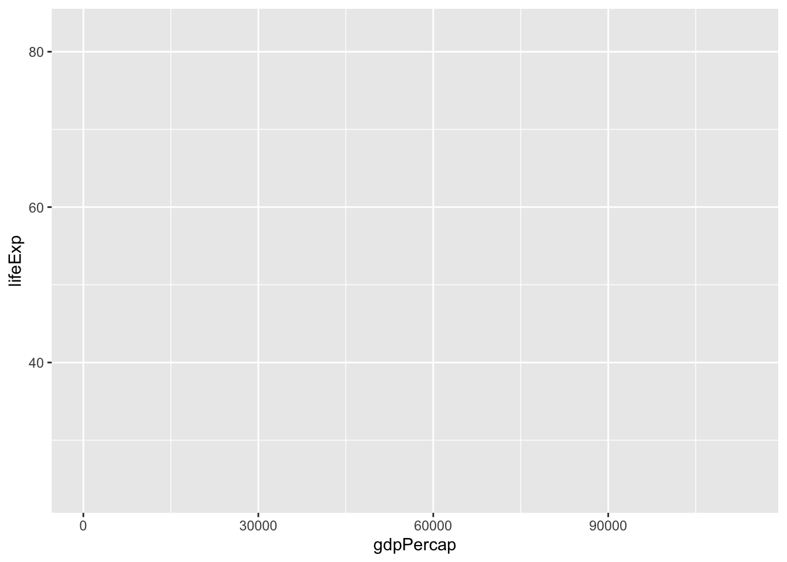


```r
p + geom_point() 
```

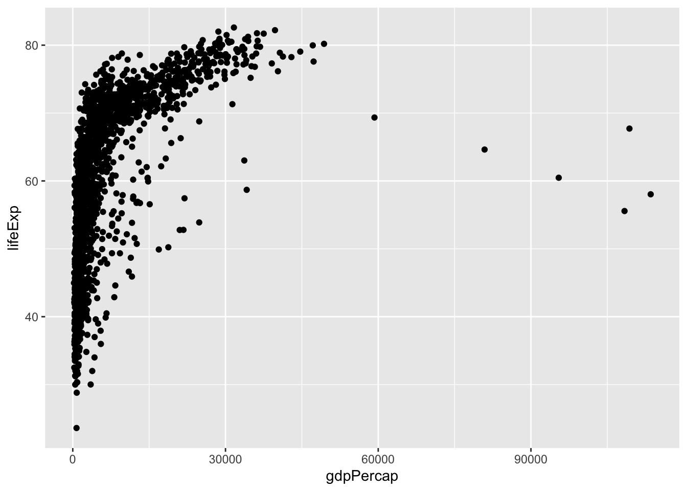


```r
p <- ggplot(data = gapminder,
            mapping = aes(x = gdpPercap,
                          y=lifeExp))
p + geom_smooth()
```

```
## `geom_smooth()` using method = 'gam' and formula 'y ~ s(x, bs = "cs")'
```

<div class="figure">
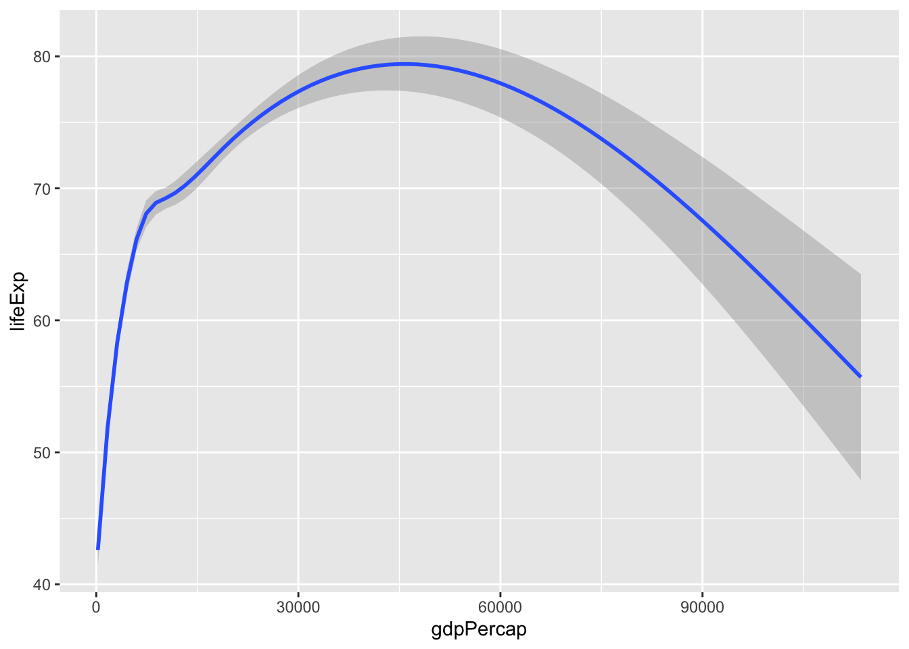
<p class="caption">(\#fig:ch-03-fig-lexp-gdp-02)Life Expectancy vs GDP, using a smoother.</p>
</div>


```r
p <- ggplot(data = gapminder,
            mapping = aes(x = gdpPercap,
                          y=lifeExp))
p + geom_point() + geom_smooth(method = "lm") 
```

```
## `geom_smooth()` using formula 'y ~ x'
```

<div class="figure">
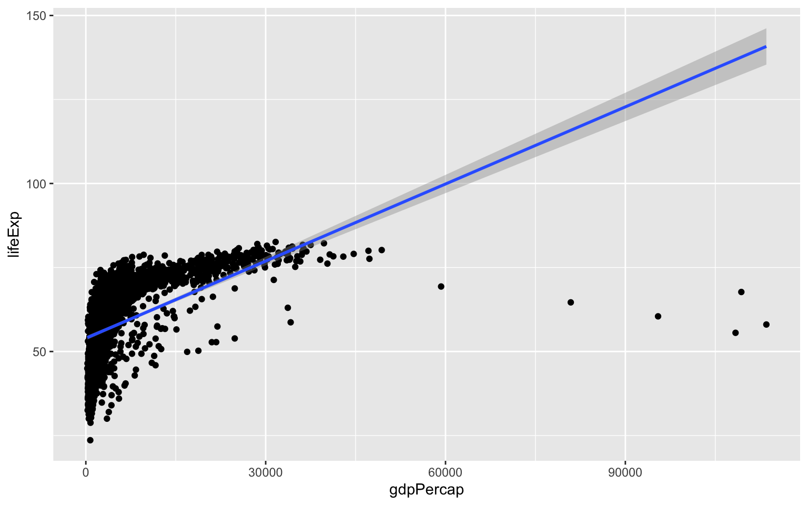
<p class="caption">(\#fig:ch-03-fig-lexp-gdp-04)Life Expectancy vs GDP, points and an ill-advised linear fit.</p>
</div>


```r
p <- ggplot(data = gapminder,
            mapping = aes(x = gdpPercap,
                          y=lifeExp))
p + geom_point() +
    geom_smooth(method = "gam") +
    scale_x_log10()
```

```
## `geom_smooth()` using formula 'y ~ s(x, bs = "cs")'
```

<div class="figure">
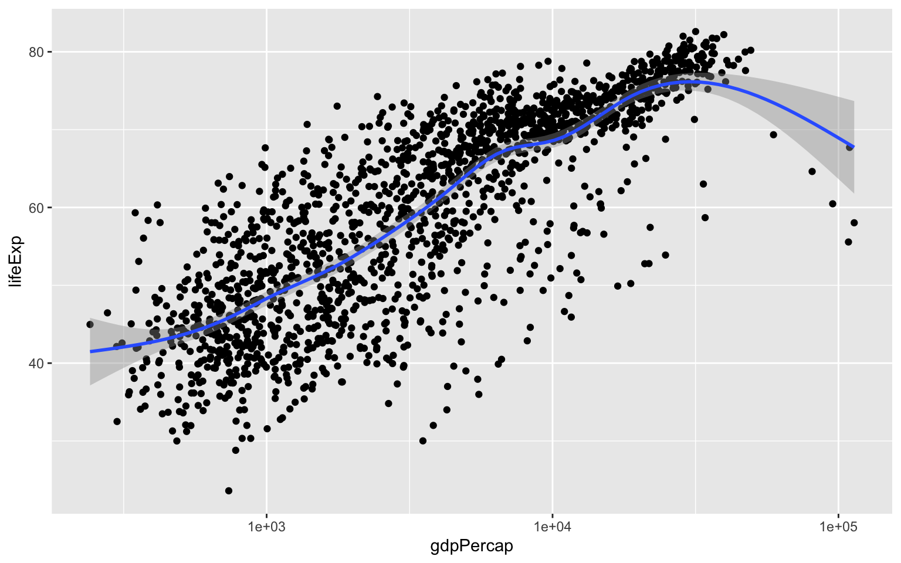
<p class="caption">(\#fig:ch-03-fig-lexp-gdp-05)Life Expectancy vs GDP scatterplot, with a GAM smoother and a log scale on the x-axis.</p>
</div>


## Mapping aesthetics vs setting them


```r
p <- ggplot(data = gapminder,
            mapping = aes(x = gdpPercap,
                          y = lifeExp,
                          color = "purple"))
p + geom_point() +
    geom_smooth(method = "loess") +
    scale_x_log10()
```

```
## `geom_smooth()` using formula 'y ~ x'
```

<div class="figure">
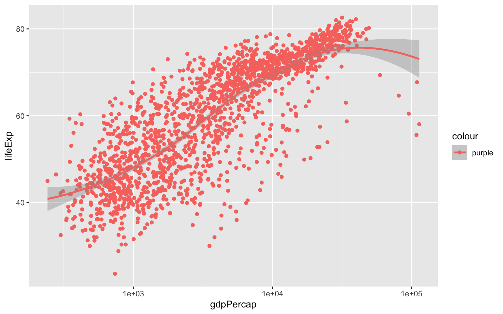
<p class="caption">(\#fig:ch-03-fig-lexp-gdp-07)What has gone wrong here?</p>
</div>


```r
p <- ggplot(data = gapminder,
            mapping = aes(x = gdpPercap,
                          y = lifeExp))
p + geom_point(color = "purple") +
    geom_smooth(method = "loess") +
    scale_x_log10()
```

```
## `geom_smooth()` using formula 'y ~ x'
```

<div class="figure">
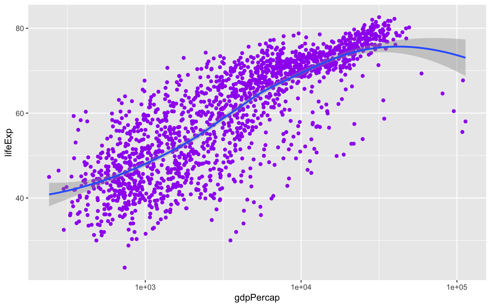
<p class="caption">(\#fig:ch-03-fig-lexp-gdp-08)Setting the color attribute of the points directly.</p>
</div>


```r
p <- ggplot(data = gapminder, mapping = aes(x = gdpPercap, y=lifeExp))
p + geom_point(alpha = 0.3) + geom_smooth(method = "gam") +
    scale_x_log10(labels = scales::dollar) +
    labs(x = "GDP Per Capita", y = "Life Expectancy in Years",
         title = "Economic Growth and Life Expectancy",
         subtitle = "Data points are country-years",
         caption = "Source: Gapminder.")
```

```
## `geom_smooth()` using formula 'y ~ s(x, bs = "cs")'
```

<div class="figure">
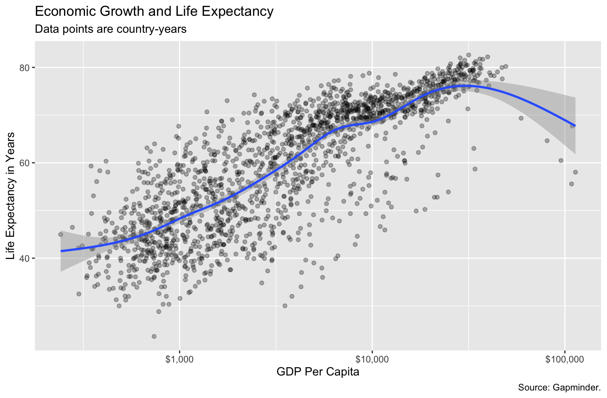
<p class="caption">(\#fig:ch-03-fig-lexp-gdp-10)A more polished plot of Life Expectancy vs GDP.</p>
</div>


```r
p <- ggplot(data = gapminder,
            mapping = aes(x = gdpPercap,
                          y = lifeExp,
                          color = continent))
p + geom_point() +
    geom_smooth(method = "loess") +
    scale_x_log10()
```

```
## `geom_smooth()` using formula 'y ~ x'
```

<div class="figure">
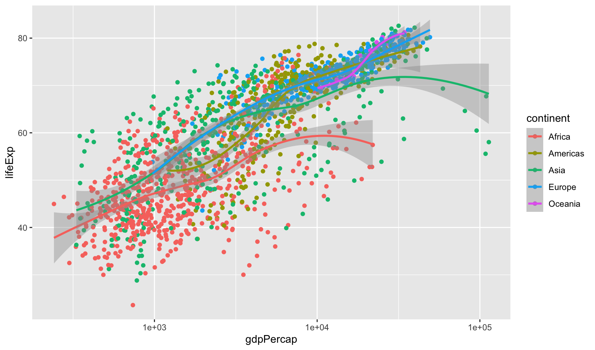
<p class="caption">(\#fig:ch-03-fig-lexp-gdp-11)Mapping the continent variable to the color aesthetic.</p>
</div>


```r
p <- ggplot(data = gapminder,
            mapping = aes(x = gdpPercap,
                          y = lifeExp,
                          color = continent,
                          fill = continent))
p + geom_point() +
    geom_smooth(method = "loess") +
    scale_x_log10()
```

```
## `geom_smooth()` using formula 'y ~ x'
```

<div class="figure">
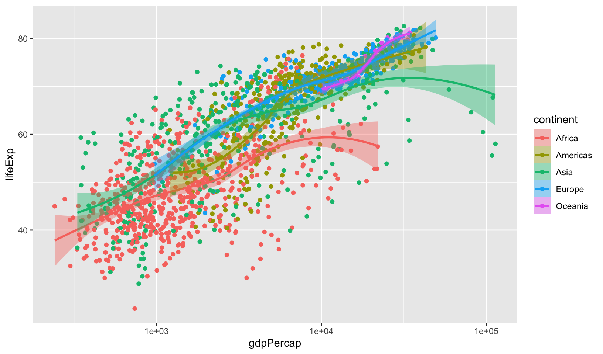
<p class="caption">(\#fig:ch-03-fig-lexp-gdp-12)Mapping the continent variable to the color aesthetic, and correcting the error bars using the fill aesthetic.</p>
</div>

# Aesthetics can be mapped per geom


```r
p <- ggplot(data = gapminder, mapping = aes(x = gdpPercap, y = lifeExp))
p + geom_point(mapping = aes(color = continent)) + geom_smooth(method = "loess") +
    scale_x_log10()
```

```
## `geom_smooth()` using formula 'y ~ x'
```

<div class="figure">
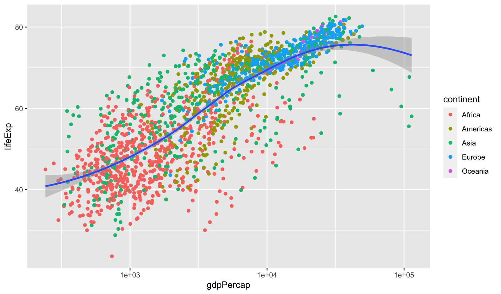
<p class="caption">(\#fig:ch-03-fig-lexp-gdp-13)Mapping aesthetics on a per-geom basis. Here color is mapped to continent for the points but not the smoother.</p>
</div>
